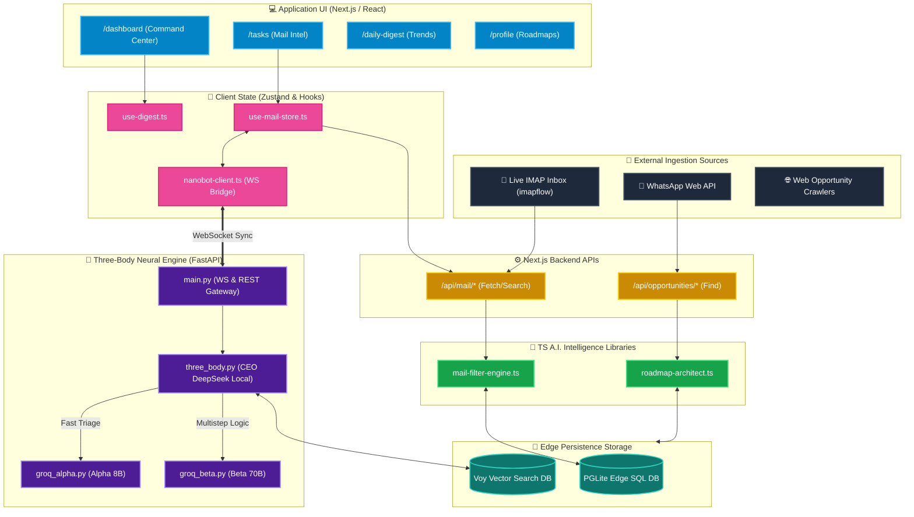

<div align="center">

# 🌌 NEXUS 🌌
### 👑 The Ultimate Aura-Farming Cognitive Engine 👑


<br/>

[](https://nextjs.org/)
[](https://fastapi.tiangolo.com/)
[](https://react.dev/)
[](https://tailwindcss.com/)
<br/>
[](https://groq.com)
[](#)
[](#)

---

*Cooked by the chaos of infinite tabs, missed hackathons, and drowning in WhatsApp spam?*

**NEXUS is here to let you cook. No cap.** 🧢
This isn’t just a basic to-do app SaaS wrapper. This is a **Sovereign, Edge-First Neural Orchestrator** that intercepts your data at the source, actively manages your roadmap, and farms aura for your academic and professional career while you literally sleep. Absolute cinema. 🎥🍿

</div>

---

## ⚡ What is NEXUS? (The TL;DR)

Traditional productivity apps are passive (major L). You have to manually log your tasks, manually add calendar events, and manually search for internships. 

**NEXUS is an active intelligence layer.** It hooks directly into your **IMAP Email** and **WhatsApp Web Socket**, using a proprietary **Three-Body Neural Engine** to silently read the chaos, extract the Ws, and hand you a crystal-clear **Command Center Dashboard**.

You get:
*   **Zero manual entry.** Everything is autonomous.
*   **Zero cloud privacy leaks.** Your primary brain runs locally. 
*   **Zero missed opportunities.** Constant web-crawling for your specific goals.

---

## 👑 The Feature Set (Why it goes so hard)

### 1. 🧠 The Three-Body Neural Engine
Why rely on one AI when you can have a whole C-Suite? 
*   **CEO (DeepSeek R1 8B):** Runs 100% locally via Ollama. It guards your privacy, holds your master context, and acts as the ultimate gigachad router.
*   **Alpha (Groq Llama-3.1 8B):** Handled via Cloud LPUs for blindingly fast O(1) text ingestion and tagging. 
*   **Beta (Groq Llama-3.3 70B):** The heavy-hitter. Triggered only when the CEO needs complex logic, multi-step roadmap planning, or active web scraping.

### 2. 📡 Omni-Channel Ingestion
NEXUS literally reads the room. We integrated `imapflow` and `whatsapp-web.js` so NEXUS can lurk your noisy group chats and spam emails, automatically pulling out real deadlines, important links, and action items. You never have to manually triage an inbox again. It's basically magic. 🪄

### 3. 📰 Daily AI Digest & Autonomous Scouting
Stop refreshing Unstop and Devfolio. NEXUS deploys Playwright/Stagehand web agents that crawl the internet for opportunities (hackathons, internships, jobs) that *actually match* your current skill mastery radar, heavily curating a **"For You"** feed every single morning.

### 4. 🗣️ Conversational RAG (Chat with your life)
Everything NEXUS ingests is embedded into a blazing fast `voy-search` Vector Database. You can open the side panel and literally ask: *"What did Professor Smith say the deadline was for that database project?"* and the Nanobot will cite the exact email thread. 

---

## 🏗️ The Gigachad Architecture

We over-engineered the absolute soul out of this so it runs flawlessly. 



---

## 🛠️ Tech Stack (The Sauce)

We strictly used the most goated, modern frameworks to ensure this thing is blazing fast and future-proof.

| Domain | Technology | Vibe Check |
| :--- | :--- | :--- |
| **Frontend** | Next.js 14, React 19, Tailwind CSS | Butter smooth, hydrated instantly 🧈 |
| **Animations**| Framer Motion | Bouncy, skeuomorphic, highly aesthetic ✨ |
| **State** | Zustand | Redux is for boomers, Zustand is lightweight W ⚡ |
| **Backend** | Python FastAPI, WebSockets | Heavy multi-threading for AI agents 🐍 |
| **Database** | PGLite, Drizzle ORM, Voy Search | Runs literally on the edge. Gigabrain data storage 💾 |
| **AI Models** | DeepSeek R1 8B, Llama 3.1 & 3.3 | Local privacy + Groq Cloud speed = Unstoppable 🥊 |

---

## 💻 Getting Started (How to boot up the Matrix)

If you want to run this absolute unit of a codebase locally, follow these steps. 

### Prerequisites
1. **Node.js 20+** (Use `nvm` don't be a savage)
2. **Python 3.11+**
3. **Ollama** installed on your system (Required for the Local CEO model).
4. Get your Groq API keys ready.

### 1. Clone & Install Frontend
```bash
git clone https://github.com/shubro18202758/Nexus.git
cd Nexus
npm install
```

### 2. Setup External Environment
Create a `.env.local` file in the root. You'll need:
```env
# The AI Sauce
GROQ_API_KEY=your_key_here
NEXT_PUBLIC_NANOBOT_URL=ws://localhost:7777/ws

# For Mail Intel
IMAP_HOST=imap.gmail.com
IMAP_PORT=993
IMAP_USER=your_email@gmail.com
IMAP_PASS=your_app_password
```

### 3. Boot the Three-Body Python Engine
```bash
cd neural_engine
python -m venv .venv
source .venv/bin/activate  # Or .venv\Scripts\activate on Windows
pip install -r requirements.txt
python main.py
```

### 4. Boot the Next.js Matrix
Open a new terminal back in the root directory:
```bash
npm run dev
```

Visit `http://localhost:3000`. Welcome to the absolute peak of human productivity. 🚀

---

## 🤝 Contributing
Want to add more aura to this repo? Feel free to fork, break things, and submit PRs. Let him cook. 👨‍🍳🔥

## 📜 License
MIT License. Do whatever you want, just don't steal our vibes. ✌️
<div align="center">
<br/>

</div>
